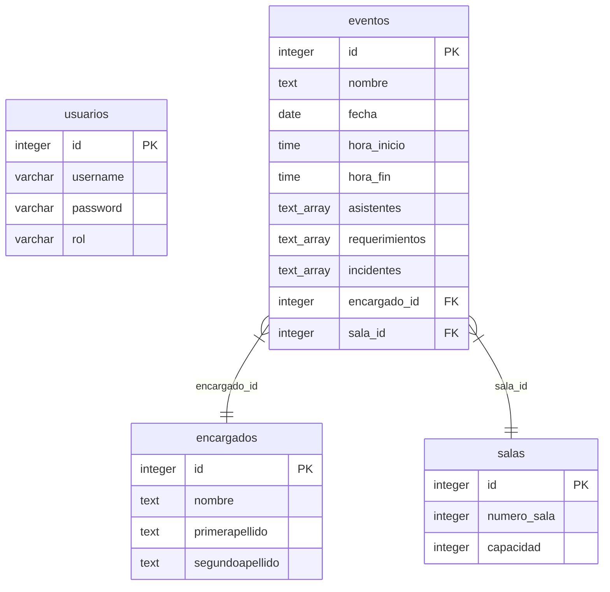

# Gestor de Salas

Sistema automatizado para la reserva y organización de espacios físicos, diseñado para reemplazar
flujos manuales y prevenir colisiones de horarios.

## Arquitectura del Proyecto

El proyecto utiliza una Arquitectura Híbrida y Compacta:

- Backend: Django (Python) con lógica de persistencia en SQL Puro (DML).
- Frontend: Django Templates con interactividad (CDN).
- Base de Datos: PostgreSQL.

### Modelo de Base de Datos



### Estructura de Directorios

```
/
├── src/                <-- Código fuente Django
│   ├── apps/           <-- Aplicaciones de negocio
│   │   ├── reservas/   <-- Gestión de salas, eventos y encargados
│   │   └── usuarios/   <-- Autenticación y perfiles
│   ├── config/         <-- Configuración central (settings, urls)
│   ├── templates/      <-- Plantillas HTML (Monolito)
│   └── manage.py       <-- Utilidad de administración
├── docs/               <-- Documentación técnica y diseño DBML
├── pyproject.toml      <-- Dependencias (UV)
├── uv.lock             <-- Lockfile de dependencias
├── .prettierrc         <-- Configuración de formateo
├── .prettierignore     <-- Exclusiones de formateo
└── setup.sh            <-- Script de configuración inicial
```

## Requisitos e Instalación

1. Gestor de paquetes: Es obligatorio usar uv. Verifica su instalación visitando la página oficial
   de [uv](https://docs.astral.sh/uv/).
2. Base de datos: Es obligatorio usar PostgreSQL.
3. Tener creada la base de datos `gestor_salas`, para ello hay que apoyarse de `psql` (en terminal)
   o `pgAdmin` (interfaz gráfica). Se necesitan los valores de conexión a la base de datos:

- `DB_NAME`: Nombre de la base de datos (por defecto `gestor_salas`).
- `DB_USER`: Usuario de la base de datos.
- `DB_PASSWORD`: Contraseña del usuario de la base de datos.
- `DB_HOST`: Host de la base de datos (por defecto `localhost`).
- `DB_PORT`: Puerto de la base de datos (por defecto `5432`).
- `SECRET_KEY`: Clave secreta para la aplicación.

```bash
# .env
DB_NAME=gestor_salas
DB_USER=...
DB_PASSWORD=...
DB_HOST=...
DB_PORT=...
SECRET_KEY=...

```

### Pasos para iniciar:

Para configurar el entorno por primera vez, ejecuta el script de automatización:

```bash
# Otorgar permisos de ejecución
chmod +x setup.sh

# Ejecutar configuración inicial
./setup.sh

# Iniciar el servidor
uv run python src/manage.py runserver
```

## Alineamiento

Para cumplir con los requerimientos de la materia:

1. DDL (Estructura) -> Django ORM: Las tablas, columnas y relaciones se definen en los archivos
   `models.py` de cada app. No usar SQL manual para crear tablas.
2. DML (Datos) -> SQL Puro: Toda operación (SELECT, INSERT, UPDATE, DELETE) debe hacerse mediante
   SQL crudo usando `connection.cursor()` en los archivos `services.py`.
3. Frontend: El proyecto es un monolito. Usa `base.html` e inyecta componentes o templates HTML.
4. Formateo: Se utiliza Ruff para Python y Prettier para HTML. Los templates están protegidos en
   `.prettierignore`.

## Credenciales de Prueba (Local)

- Usuario: admin
- Password: admin123
- URL Login: http://localhost:8000

> Nota: Se pueden modificar las credenciales en el script `setup.sh`.

---

Desarrollado para la materia de Bases de Datos I como proyecto final.

Licencia: MIT
